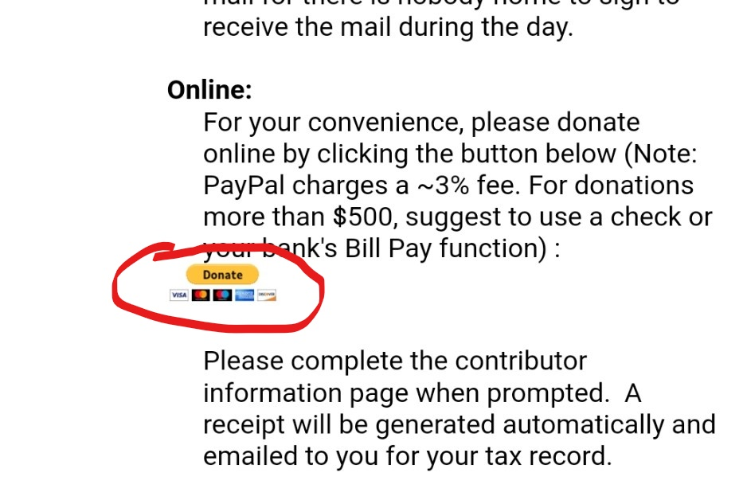
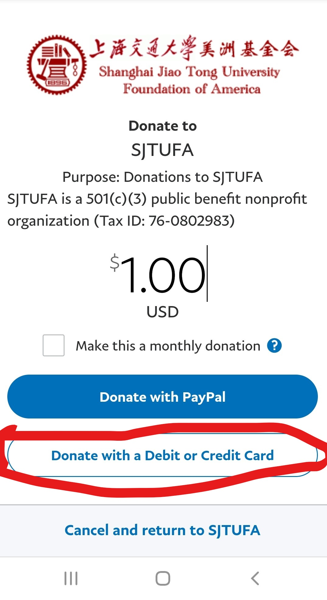
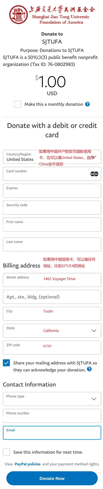
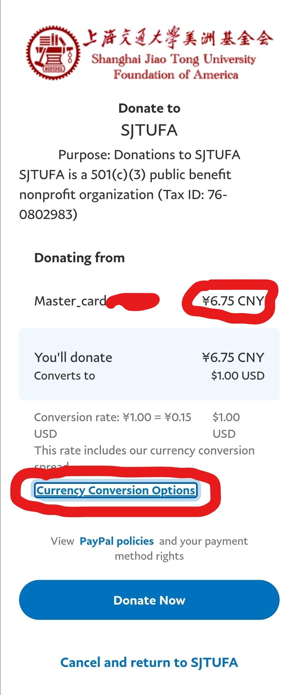
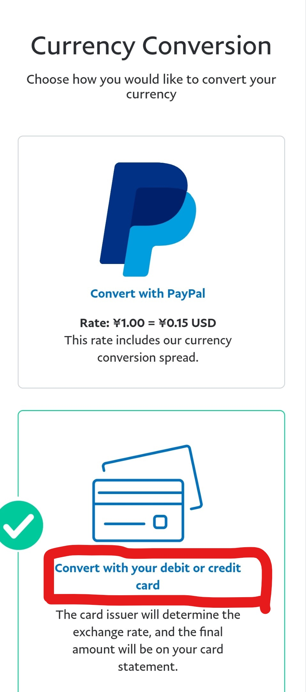
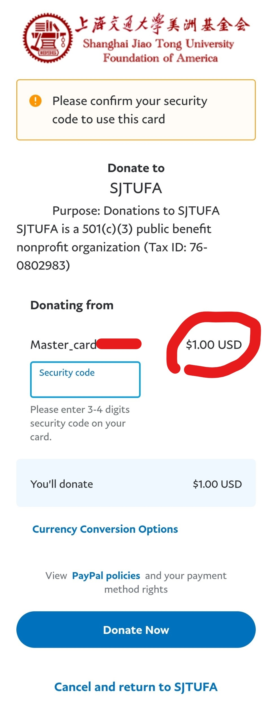
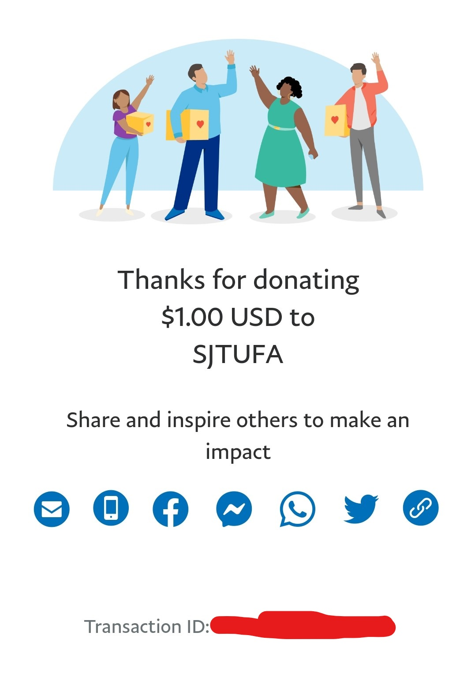
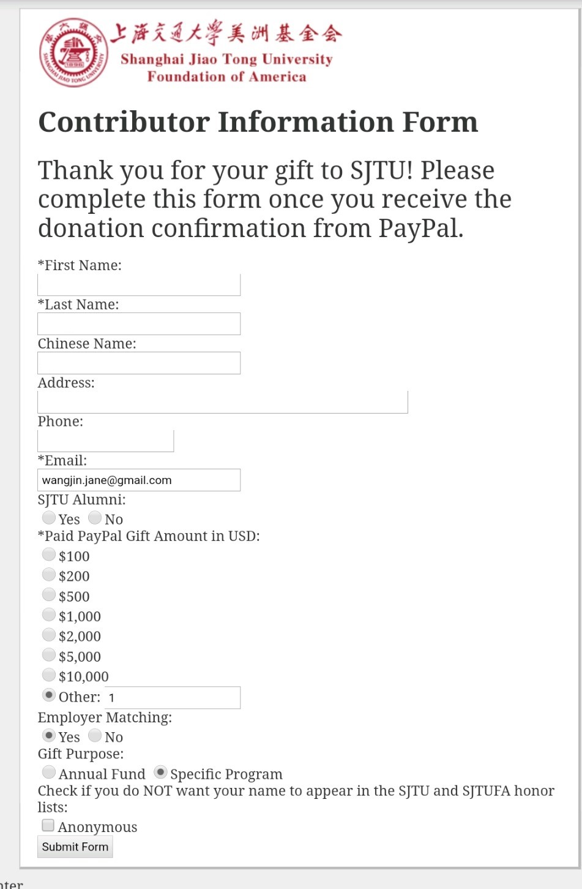
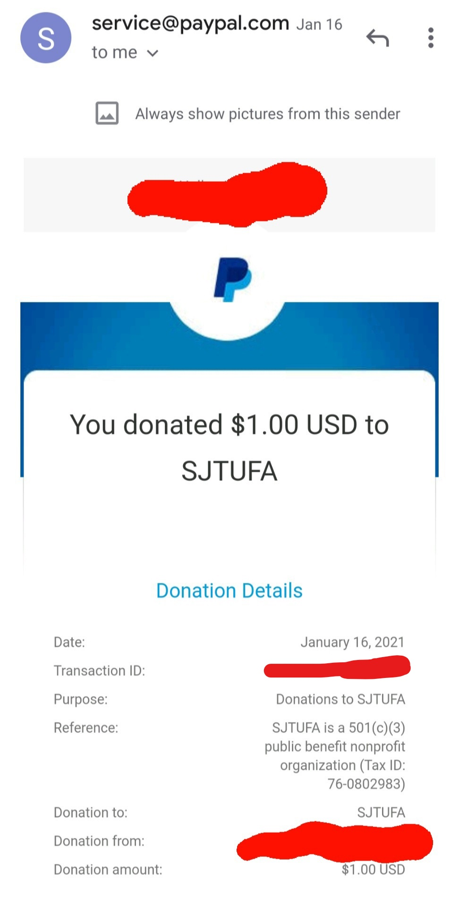

# 在线向SJTUFA捐款的方法(信用卡英文界面)

1. 至SJTUFA捐款网页：[http://www.sjtufa.org/donations.htm](http://www.sjtufa.org/donations.htm)，找到Donate按钮

2. 填写捐赠金额，并且选择用信用卡或借记卡付款

3. 填写信用卡信息并单击“捐赠”进行提交

4. 如果使用国际信用卡(如人民币美元双币信用卡)，有可能显示为非美元金额，请单击“汇率转换选项”改变为美元结算，否则有可能捐款不成功。

5. 汇率转换选项应该选为“由信用卡转换”，而非由Paypal转换

6. 修改汇率转换选项后，页面应该显示为美元结算。

7. 提交捐赠后显示捐赠成功

8. 捐赠完成后将会跳转至捐赠者信息表页面，请跳过此页面，不需要填写。因为即使填写完成后，提交也会出错。我们与SJTUFA沟通过，这是他们服务器端的问题，暂时无法解决。捐赠完成后请与捐赠联系人确认或发送邮件至 [sjtu.irving.t.ho.scholarship@gmail.com](mailto:sjtu.irving.t.ho.scholarship@gmail.com)以便我们记录您的捐赠。

9. 捐赠者将会通过Email收到Paypal发出的捐赠收据，可作为抵税收据。

